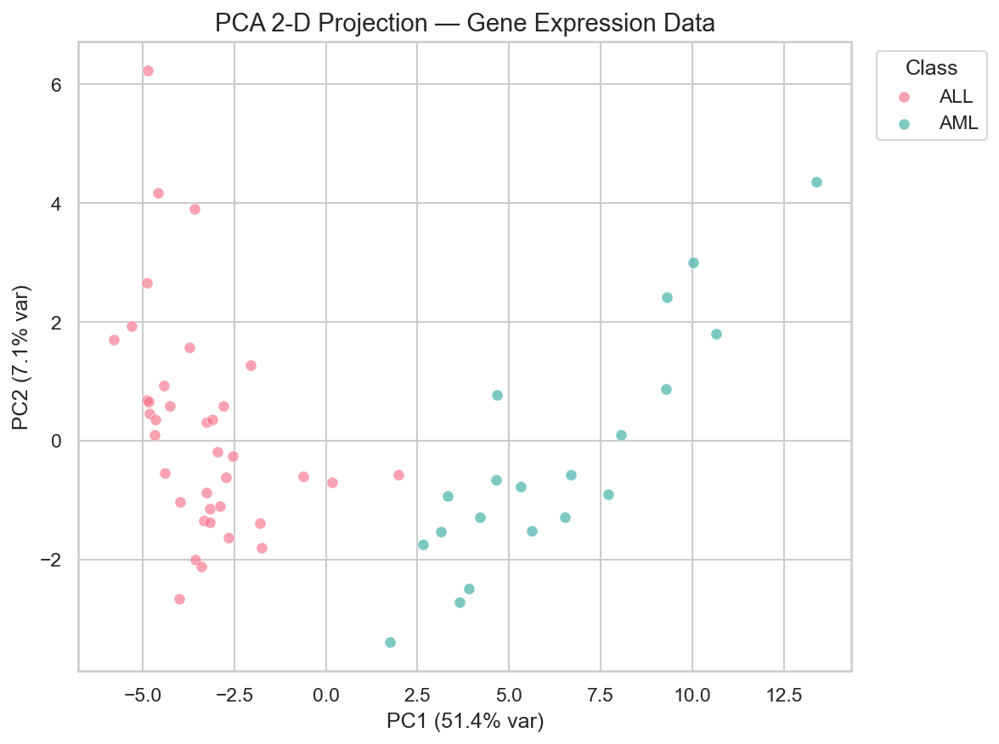
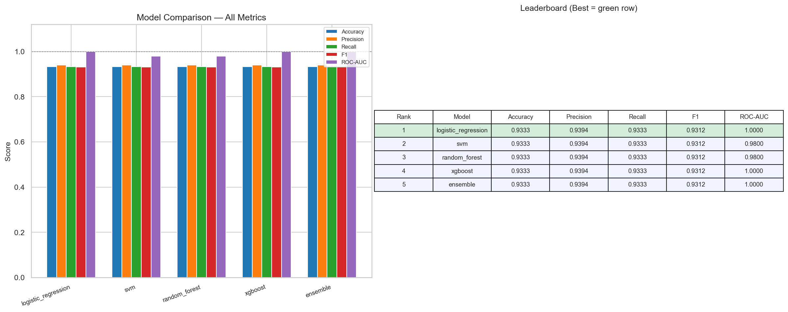
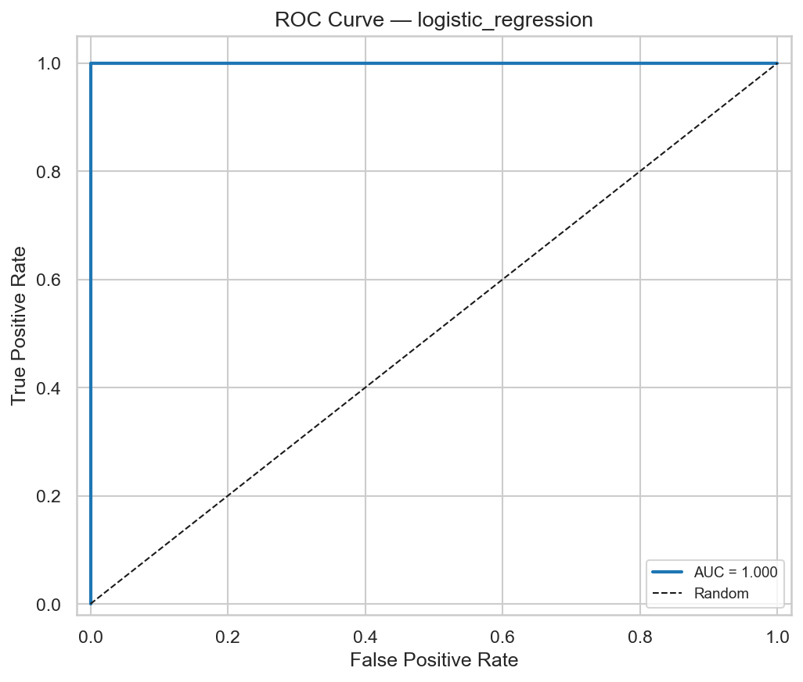
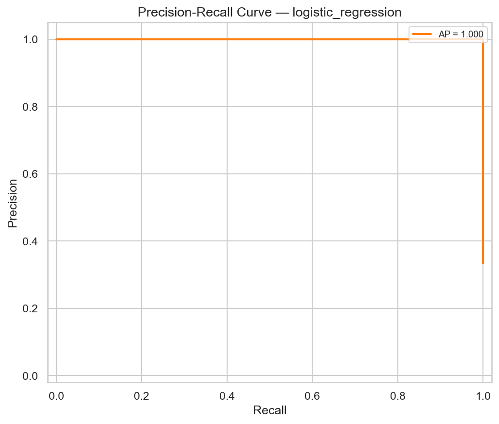
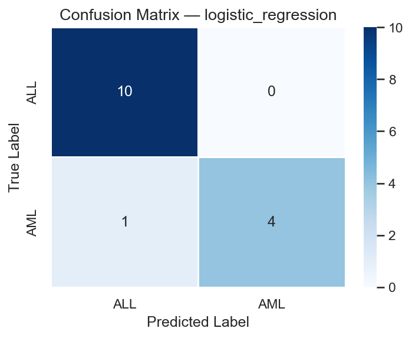
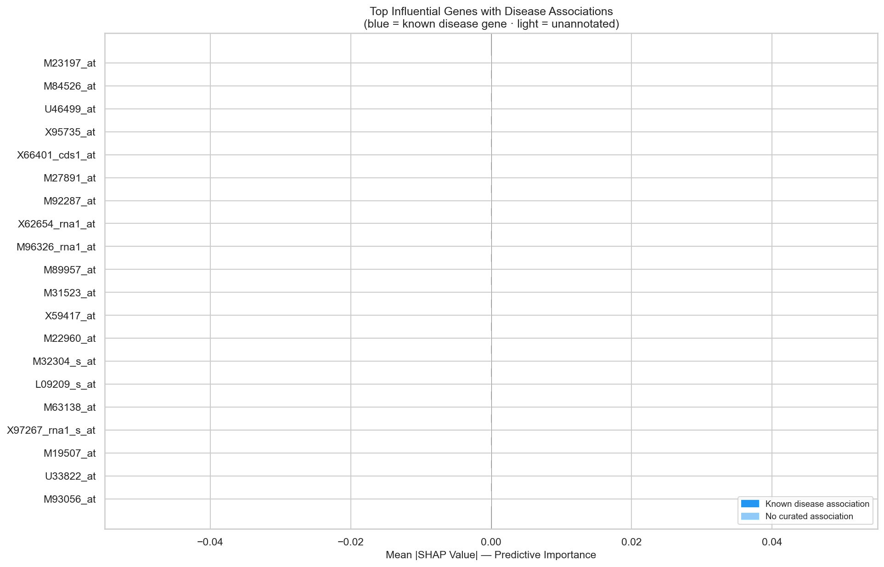

# Gene Expression Disease Prediction Pipeline


A complete, end-to-end, research-grade machine learning pipeline engineered specifically for **Bioinformatics and Computational Biology**. This system ingests highly-dimensional gene expression data (e.g., RNA-Seq or Microarray readings), applies advanced statistical preprocessing, handles severe class imbalances, and trains an ensemble of state-of-the-art predictive models to classify disease states (e.g., Tumor classification, Leukemia subtyping).

Crucially, the pipeline is designed to be a "glass box," utilizing **SHAP (SHapley Additive exPlanations)** and the **MyGene.info REST API** to uncover the biological mechanisms behind its predictions, providing researchers with interpretable candidate biomarkers rather than just statistical accuracies.

---

## 🔬 System Overview & Capabilities

Standard machine learning approaches often fail on genomic data due to the "Curse of Dimensionality" (thousands of genes, but only dozens of patients). This pipeline is purpose-built to overcome this through a robust, multi-stage architecture:

1. **Intelligent Feature Selection:** Uses statistical heuristics (`SelectKBest` with ANOVA F-values, Lasso Regularization, or Variance Thresholding) to isolate only the core predictive genes out of tens of thousands of background variables.
2. **Synthetic Minority Over-sampling (SMOTE):** Clinical datasets are rarely balanced. The pipeline automatically interpolates minority patient classes (e.g., a rare tumor variant) in the generated latent space to neutralize algorithm bias.
3. **Dimensionality Reduction (PCA):** Condenses vast genetic profiles into dense principal components prior to model training, drastically reducing overfitting while retaining over 90% of the dataset's variance.
4. **Automated Hyperparameter Tuning:** Executes high-cardinality `RandomizedSearchCV` or `GridSearchCV` cross-validation across multiple algorithms to autonomously discover optimal algorithmic configurations.
5. **Soft Voted Ensembling:** Instead of relying on a single algorithm, the system fuses predictions from Logistic Regression, Support Vector Machines (SVM), Random Forests, and Gradient Boosting (XGBoost) to achieve a highly resilient consensus prediction.

---

## 🚀 Installation & Setup

Ensure you are running Python 3.9 or higher. 

**1. Clone the repository and install the dependencies:**
```bash
git clone https://github.com/Bhargav-1212/-Gene-Expression-Disease-Prediction-Pipeline.git
cd -Gene-Expression-Disease-Prediction-Pipeline
pip install -r requirements.txt
```

**2. Prepare your Data:**
Place your generic dataset in the `data/` directory. The CSV should contain:
- A clear target class column (e.g., `CLASS` or `disease_label`).
- Thousands of columns containing raw/normalized continuous expression values, where column headers are valid Gene Symbols (e.g., `TP53`), Transcript IDs, or Microarray Probes (e.g., `M23197_at`).

*(Note: You can run `python generate_synthetic_data.py` to test the pipeline on auto-generated dummy genomic noise).*

---

## 🕹️ Command Line Usage

The entire computational pipeline is triggered via a single entry point, governed entirely by strict YAML configuration mappings.

```bash
# Standard Production Run
python train.py --config configs/config.yaml

# Fast Iteration Mode (bypasses the lengthy CV Hyperparameter grid search)
python train.py --config configs/config.yaml --no-tuning

# Completely Offline Mode (Bypasses external API/Gene Database lookups)
python train.py --config configs/config.yaml --no-annotation

# Train exclusively specific ML algorithms based on config definitions
python train.py --config configs/config.yaml --models xgboost svm
```

---

## 📊 Visual Outputs (Plots & Diagrams)

A primary focus of this pipeline is generating clinical-grade visualizations in the `outputs/` folder. Here is exactly what the pipeline produces and how to interpret them:

### 1. Principal Component Analysis (Data Clustering)
**File:** `outputs/pca_2d_scatter.png`

Before training, the pipeline compresses the thousands of genes into 2 axes using PCA. This scatter plot visually proves whether your raw genomic data naturally separates the Disease and Healthy patients into distinct clusters.



### 2. Model Performance Leaderboard
**File:** `outputs/model_comparison.png`

A heavily stylized bar chart comparing the performance of SVM, Random Forest, Logistic Regression, XGBoost, and your final Ensemble model. It tracks Accuracy, F1 Score, and ROC-AUC simultaneously.



### 3. Receiver Operating Characteristic (ROC) & Precision-Recall 
**Files:** `outputs/roc_curve_<model>.png` & `outputs/pr_curve_<model>.png`

These plots graph the true positive rate versus the false positive rate across multiple cutoff thresholds. A model curve hugging the top-left corner indicates excellent diagnostic ability, even on imbalanced medical datasets.




### 4. Confusion Matrices (Error Detection)
**File:** `outputs/confusion_matrix_<model>.png`

Heatmaps mapping actual disease states against predicted ones. They mathematically reveal where the model is succeeding (the diagonal line) vs specifically what disease types it considers "confusing" or identical.



### 5. Deep Biological Interpretability (SHAP Values)
**File:** `outputs/shap_summary_<model>.png`

This calculates the exact mathematical gravity of the top 20 genes. Instead of a "black box" prediction, SHAP proves exactly how up-regulating (high expression) or down-regulating a specific gene physically shifts the model's diagnosis toward Disease A or Disease B.

.png)

### 6. Gene Annotation Importance Rating ⭐
**File:** `outputs/gene_annotation_importance.png`

*The flagship feature of the pipeline.* It aligns the statistical SHAP impact scores with true biological associations pulled from the `MyGene.info` API. It outputs a clinical bar chart tagging which influential genes are actively corroborated as pathogenic agents in global peer-reviewed literature.



---

## ⚙️ Pipeline Configuration

The `configs/config.yaml` controls all internal architecture mechanisms.

```yaml
data:
  file_path: "data/golub_leukemia.csv"
  target_column: "CLASS"          
  test_size: 0.2                  # 80/20 Train/Test Validation Split

class_imbalance:
  strategy: "smote"               # Applies spatial minority oversampling 

feature_selection:
  method: "selectkbest"           # Applies ANOVA F-Value variance thresholds
  top_k: 50                       # Isolates the top 50 genomic features 

models:
  tuning:
    enabled: true                 # Instructs architecture to optimize sub-algorithms
    cv_folds: 5                   # Straticated 5-fold cross validation split
```

---

## 📜 License & Citation

This codebase is provided as an open-source clinical research tool. When utilizing `gene_annotator.py` outputs in published biological research, please ensure you properly cite the [MyGene.info API](http://mygene.info/) query backbone.
